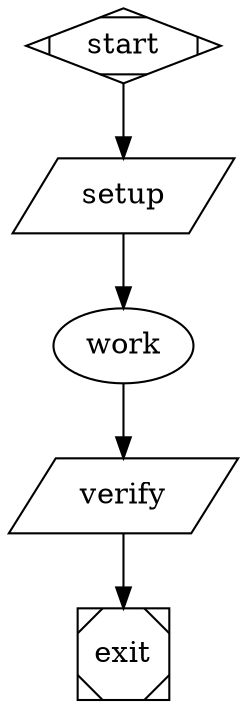
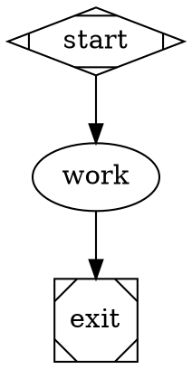

# Daytona Real-Agent Smoke QA Plan

## Purpose

Manually smoke test the `add-acp-backend` branch with real LLM-backed agents running against Daytona sandboxes.

The key branch constraint is intentional: ACP requires bidirectional raw stdio and is not supported by Daytona in this cutover. This QA plan therefore uses Daytona for positive real-agent coverage through the API and CLI backends, then verifies ACP-on-Daytona fails clearly instead of falling back to host execution or PTY transport.

## Scope

In scope:

- A real API-backed agent running in a Daytona sandbox.
- A real CLI-backed agent running in a Daytona sandbox.
- An ACP-backed node on Daytona returning the expected unsupported-provider failure.
- Evidence capture through `inspect`, `events`, `dump`, and optional preserved-sandbox SSH.

Out of scope:

- Automated nextest coverage.
- ACP positive execution on Daytona.
- Full regression of Docker or local ACP behavior.
- Snapshot creation performance tuning beyond what is needed to run the smoke.

## Preconditions

- Current branch is `add-acp-backend`.
- Daytona API key is available with sandbox/snapshot scopes.
- At least one real LLM credential is available. The commands below use Anthropic.
- GitHub access is configured if the operator chooses not to use `skip_clone = true`.
- Network access from Daytona allows installing CLI packages for the CLI smoke.

Recommended environment:

```bash
cargo build -p fabro-cli
export FABRO=./target/debug/fabro

set -a
source .env
set +a

$FABRO doctor -v
```

Required environment variables for the default path:

- `DAYTONA_API_KEY`
- `ANTHROPIC_API_KEY`

## Test Data Setup

Create a scratch directory for manual smoke files:

```bash
mkdir -p smoke tmp
```

All smoke configs use `skip_clone = true` to avoid depending on pushed branch state. This keeps the test focused on Daytona runtime behavior and real agent execution.

## Smoke 1: Daytona API Backend With Real Agent

### Goal

Prove a real provider API agent can use Fabro-managed tools inside the Daytona sandbox and mutate the sandbox filesystem.

### Files

Create `smoke/daytona_api.fabro`:



Create `smoke/daytona_api.toml`:

```toml
_version = 1

[workflow]
graph = "smoke/daytona_api.fabro"

[run.sandbox]
provider = "daytona"
preserve = true

[run.sandbox.daytona]
skip_clone = true
auto_stop_interval = 60
```

### Run

```bash
$FABRO run --auto-approve smoke/daytona_api.toml
```

### Pass Criteria

- Run exits successfully.
- The `verify` stage prints `daytona-api-ok`.
- `fabro events <run-id> --tail 200` includes:
  - `sandbox.ready`
  - `agent.session.activated`
  - `stage.completed` for `work`
  - `stage.completed` for `verify`
- `fabro inspect <run-id>` shows the run succeeded.

### Failure Notes

- Provider authentication failures are setup failures unless the error indicates sandbox routing or missing Daytona state.
- Missing `smoke_api_result.txt` after a successful agent stage is a failure.

## Smoke 2: Daytona CLI Backend With Real Agent

### Goal

Prove the branch runs a real external CLI agent inside Daytona when the CLI is preinstalled by the workflow environment. This also confirms Fabro no longer installs CLIs implicitly at stage runtime.

### Files

Create `smoke/daytona_cli.fabro`:


Create `smoke/daytona_cli.toml`:

```toml
_version = 1

[workflow]
graph = "smoke/daytona_cli.fabro"

[run.sandbox]
provider = "daytona"
preserve = true

[run.sandbox.daytona]
skip_clone = true
auto_stop_interval = 60

[[run.prepare.steps]]
script = '''
set -eu
mkdir -p "$HOME/.local"
if ! command -v node >/dev/null 2>&1; then
  curl -fsSL https://nodejs.org/dist/v22.14.0/node-v22.14.0-linux-x64.tar.gz | tar -xz --strip-components=1 -C "$HOME/.local"
fi
export PATH="$HOME/.local/bin:$PATH"
npm config set prefix "$HOME/.local"
command -v claude >/dev/null 2>&1 || npm install -g @anthropic-ai/claude-code
claude --version
'''
```

### Run

```bash
$FABRO run --auto-approve smoke/daytona_cli.toml
```

### Pass Criteria

- Run exits successfully.
- The `verify` stage prints `daytona-cli-ok`.
- `fabro events <run-id> --tail 200` includes:
  - `setup.started`
  - `setup.completed`
  - `agent.cli.started`
  - `agent.cli.completed`
  - `stage.completed` for `verify`
- Events do not include new `cli.ensure.started`, `cli.ensure.completed`, or `cli.ensure.failed` entries for this branch's runtime path.

### Failure Notes

- `CLI backend requires 'claude' to be installed in the sandbox PATH` means the prepare step did not install the CLI where the backend expects it. Treat this as environment/setup failure unless the prepare logs prove `claude` was installed in `$HOME/.local/bin`.
- CLI package-install failures may be caused by Daytona network policy or npm registry availability.

## Smoke 3: Daytona ACP Backend Expected Unsupported Failure

### Goal

Prove ACP on Daytona fails explicitly because Daytona lacks bidirectional raw stdio support. This test guards against unsafe fallbacks such as running ACP on the host or over a PTY.

### Files

Create `smoke/daytona_acp_unsupported.fabro`:



Create `smoke/daytona_acp_unsupported.toml`:

```toml
_version = 1

[workflow]
graph = "smoke/daytona_acp_unsupported.fabro"

[run.sandbox]
provider = "daytona"
preserve = true

[run.sandbox.daytona]
skip_clone = true
auto_stop_interval = 60
```

### Run

```bash
$FABRO run --auto-approve smoke/daytona_acp_unsupported.toml
```

### Pass Criteria

- Run fails.
- The failure text contains:
  - `ACP backend requires bidirectional stdio`
  - `Daytona sandbox provider does not support it yet`
- Events include `agent.acp.started`.
- Events do not include `agent.acp.completed`.
- The preserved Daytona sandbox does not contain `smoke_acp_result.txt`.

### Failure Notes

- If the run succeeds, that is a failure for this branch because ACP should not execute on Daytona.
- If the failure is about `acp_command` missing, the workflow file is wrong.
- If the failure is about `npx` missing before the Daytona unsupported error, inspect the code path: the smoke should prove the sandbox stdio provider boundary, not package availability.

## Optional Variant: Codex Or Gemini CLI On Daytona

If Anthropic CLI smoke passes and broader real-agent coverage is desired, repeat Smoke 2 with another provider:

- OpenAI CLI: install `@openai/codex`, use `provider="openai"`, and require `OPENAI_API_KEY`.
- Gemini CLI: install `@google/gemini-cli`, use `provider="gemini"`, and require `GEMINI_API_KEY`.

Keep these as optional because they increase external-provider flake surface without changing the branch's Daytona ACP boundary.

## Evidence Capture

For each run, capture:

```bash
$FABRO inspect <run-id>
$FABRO events <run-id> --tail 200
$FABRO dump --output tmp/<run-id>-dump <run-id>
```

For preserved Daytona sandboxes, inspect the filesystem:

```bash
$FABRO sandbox ssh <run-id>
pwd
ls -la
cat smoke_api_result.txt 2>/dev/null || true
cat smoke_cli_result.txt 2>/dev/null || true
cat smoke_acp_result.txt 2>/dev/null || true
exit
```

Record for each run:

- Run ID.
- Command used.
- Final status.
- Relevant event names.
- Whether expected files exist in Daytona.
- Any external-provider or Daytona infrastructure errors.

## Cleanup

After evidence capture:

```bash
$FABRO rm -f <run-id>
```

Verify preserved Daytona sandboxes are gone from the Daytona dashboard or by rerunning `fabro inspect <run-id>` and confirming no active sandbox remains.

## Final Acceptance Criteria

The branch passes this manual QA plan when:

1. The API backend smoke succeeds with a real agent on Daytona.
2. The CLI backend smoke succeeds with a real agent on Daytona after explicit CLI installation in prepare steps.
3. The ACP Daytona smoke fails with the expected unsupported bidirectional-stdio message.
4. No evidence shows ACP ran on the host, used a PTY fallback, or silently fell back to API/CLI.
5. Captured run events and dumps are sufficient to diagnose any failure without rerunning immediately.
