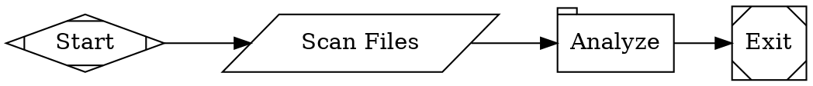

Fabro workflows are written in a subset of the [Graphviz DOT language](https://graphviz.org/doc/info/lang.html) with extensions for agent orchestration. This page is the complete syntax reference. For conceptual introductions, see [Workflows](/core-concepts/workflows) and [Nodes & Stages](/workflows/stages-and-nodes).

## File structure

Every workflow is a `digraph` (directed graph) with a name and a body of statements:



Only `digraph` is supported — `graph` (undirected) and `strict` are not. The graph name is required. Semicolons after statements are optional.

## Comments

```dot
// Line comment — everything to end of line

/* Block comment
   spanning multiple lines */
```

Comments inside quoted strings are preserved as literal text.

## Value types

Attribute values in `[key=value]` blocks can be:

| Type | Syntax | Examples |
|---|---|---|
| String | Double-quoted | `"Run tests"`, `"line1\nline2"` |
| Integer | Bare digits, optional sign | `42`, `-1`, `0` |
| Float | Digits with decimal point | `3.14`, `-0.5`, `.5` |
| Boolean | Keywords | `true`, `false` |
| Duration | Integer with unit suffix | `250ms`, `30s`, `15m`, `2h`, `1d` |
| Bare string | Identifier with hyphens/dots | `claude-sonnet-4-5`, `gpt-5.2-codex` |
| Identifier | Bare word | `LR`, `box`, `Mdiamond` |

**Escape sequences** in quoted strings: `\"`, `\\`, `\n`, `\t`.

**Duration units:** `ms` (milliseconds), `s` (seconds), `m` (minutes), `h` (hours), `d` (days).

## Statements

The body of a digraph can contain these statement types:

### Graph attributes

Set workflow-level configuration:

```dot
// Block syntax
graph [goal="Build a feature", model_stylesheet="* { model: claude-haiku-4-5; }"]

// Declaration syntax
rankdir=LR
```

| Attribute | Type | Description |
|---|---|---|
| `goal` | String | Workflow objective — guides agent behavior |
| `rankdir` | Identifier | Layout direction: `LR` (left-to-right) or `TB` (top-to-bottom) |
| `model_stylesheet` | String | CSS-like rules for model assignment (see [Model Stylesheets](/workflows/stylesheets)) |
| `default_max_retries` | Integer | Default retry count for all nodes (default: 0) |
| `retry_target` | String | Default node ID to jump to on retry |
| `fallback_retry_target` | String | Fallback retry target if primary target fails |
| `default_fidelity` | String | Default [fidelity level](/execution/context) for all nodes |
| `default_thread` | String | Default thread ID for all nodes |
| `max_node_visits` | Integer | Max visits per node across the run (0 = unlimited) |
| `stall_timeout` | Duration | Timeout for stalled workflows (default: `1800s`, 0 = disabled) |
| `loop_restart_signature_limit` | Integer | Max times the same failure signature can repeat before aborting (default: 3) |

### Node defaults

Apply default attributes to all subsequently declared nodes:

```dot
node [shape=box, timeout="900s"]
```

Defaults are scoped to their enclosing subgraph. Explicit attributes on individual nodes override defaults.

### Edge defaults

Apply default attributes to all subsequently declared edges:

```dot
edge [weight=5]
```

### Node declarations

Declare a node with optional attributes:

```dot
plan [label="Plan", prompt="Create an implementation plan."]
```

**Node identifiers** must start with a letter or underscore, followed by letters, digits, or underscores (e.g. `run_tests`, `gate_1`, `_private`).

Nodes referenced in edges are auto-created if not explicitly declared.

### Edge declarations

Connect nodes with directed edges:

```dot
start -> plan -> implement -> exit
```

Chained edges like `A -> B -> C` expand to individual edges `A -> B` and `B -> C`, all sharing the same attributes.

Edges can have attributes:

```dot
gate -> exit      [label="Pass", condition="outcome=succeeded"]
gate -> implement [label="Fix"]
```

### Subgraphs

Group nodes visually and apply scoped defaults:

```dot
subgraph cluster_impl {
    label = "Implementation"
    node [thread_id="impl", fidelity="full"]

    plan      [label="Plan"]
    implement [label="Implement"]
    review    [label="Review"]
}
```

When a subgraph has a `label`, it is converted to a CSS class name and applied to all nodes within the subgraph (e.g. `"Implementation"` becomes class `implementation`, `"Loop A"` becomes `loop-a`). This enables [stylesheet](/workflows/stylesheets) targeting.

Node and edge defaults declared inside a subgraph are scoped — they don't leak to the outer graph. Edges can cross subgraph boundaries.

## Node types

Each node's `shape` attribute determines its execution behavior. See [Nodes & Stages](/workflows/stages-and-nodes) for detailed documentation of each type.

| Shape | Handler | Purpose |
|---|---|---|
| `Mdiamond` | start | Workflow entry point (exactly one required) |
| `Msquare` | exit | Workflow terminal (exactly one required) |
| `box` (default) | agent | Multi-turn LLM with tool access |
| `tab` | prompt | Single LLM call, no tools |
| `parallelogram` | command | Execute a shell script |
| `hexagon` | human | Human-in-the-loop decision gate |
| `diamond` | conditional | Route based on conditions |
| `component` | parallel | Fan-out to concurrent branches |
| `tripleoctagon` | parallel.fan_in | Merge parallel branch results |
| `insulator` | wait | Pause for a duration |
| `house` | stack.manager_loop | Sub-workflow orchestration |

The `type` attribute can also be set explicitly to override the shape-based mapping.

Start nodes can also be identified by ID (`start` or `Start`). Exit nodes can be identified by ID (`exit`, `Exit`, `end`, or `End`).

## Node attributes

### All nodes

| Attribute | Type | Description |
|---|---|---|
| `label` | String | Display name in the graph visualization |
| `shape` | Identifier | Graphviz shape — determines handler type (see table above) |
| `type` | String | Explicit handler type (overrides shape) |
| `class` | String | Comma-separated classes for [stylesheet](/workflows/stylesheets) targeting |
| `timeout` | Duration | Execution timeout (e.g. `900s`) |
| `max_visits` | Integer | Max times this node can execute in a run. Overrides the graph-level `max_node_visits` for this node. |
| `max_retries` | Integer | Override default retry count |
| `retry_policy` | String | Named preset: `none`, `standard`, `aggressive`, `linear`, `patient` |
| `retry_target` | String | Node ID to jump to on retry |
| `fallback_retry_target` | String | Fallback node ID if primary `retry_target` is unreachable |
| `goal_gate` | Boolean | When `true`, workflow fails if this node didn't finish with `succeeded` or `partially_succeeded`. See [Node Outcomes](/execution/outcomes#goal-gate-interaction). |
| `auto_status` | Boolean | When `true`, overrides any non-`succeeded`/non-`skipped` outcome to `succeeded` after the handler completes. See [Node Outcomes](/execution/outcomes#auto_status). |
| `allow_partial` | Boolean | When `true` and retries are exhausted on a retry-requesting failure, promotes the outcome to `partially_succeeded` instead of `failed`. Default `false`. See [Node Outcomes](/execution/outcomes#allow_partial). |
| `selection` | String | Edge tiebreaking strategy: `deterministic` (default) or `random` (weighted-random). Cannot be combined with conditional edges. |

### Agent and prompt nodes

| Attribute | Type | Description |
|---|---|---|
| `prompt` | String | Task instructions for the LLM. Supports file references with `@path/to/file.md` |
| `reasoning_effort` | String | `low`, `medium`, or `high` (default: `high`) |
| `max_tokens` | Integer | Maximum output tokens |
| `fidelity` | String | How much prior context is passed: `compact`, `full`, `summary:high`, `summary:medium`, `summary:low`, `truncate` |
| `thread_id` | String | Groups nodes into a shared conversation thread |
| `model` | String | Explicit model ID (overrides stylesheet) |
| `provider` | String | Explicit provider name (overrides stylesheet). Auto-inferred from the model catalog when omitted. |
| `project_memory` | Boolean | When `true` (default), prompt nodes discover and include project docs (`AGENTS.md`, `CLAUDE.md`, etc.) as a system prompt. Set to `false` to disable. |
| `backend` | String | Agent execution backend: `api` (default), `cli`, or `acp`. `api` runs Fabro's tool loop through provider APIs; `cli` delegates to the legacy provider CLI; `acp` runs an Agent Client Protocol stdio agent inside the active sandbox. See [Agents — Backends](/core-concepts/agents#backends). |
| `acp_command` | String | Optional ACP stdio command override for nodes with `backend="acp"`. Defaults are selected from `provider`; model selection is recorded in Fabro but not sent through stable ACP v1. |

### Command nodes

| Attribute | Type | Description |
|---|---|---|
| `script` | String | Shell command to execute |
| `language` | String | `"shell"` (default) or `"python"` |

### Parallel (fan-out) nodes

| Attribute | Type | Description |
|---|---|---|
| `join_policy` | String | When the merge can proceed: `wait_all` (default), `first_success` |
| `max_parallel` | Integer | Maximum concurrent branches (default: 4) |

### Wait nodes

| Attribute | Type | Description |
|---|---|---|
| `duration` | Duration | How long to pause (required). E.g. `"30s"`, `"2m"` |

### Human nodes

| Attribute | Type | Description |
|---|---|---|
| `question_type` | String | Optional interview question type override: `yes_no`, `confirmation`, `multiple_choice`, `multi_select`, or `freeform`. Defaults to `freeform` when the gate only has a freeform edge; otherwise defaults to `multiple_choice`. |
| `human.default_choice` | String | Target node to use when the question times out. |

### Manager loop (sub-workflow) nodes

| Attribute | Type | Description |
|---|---|---|
| `stack.child_workflow` | String | Path to child workflow `.fabro` file (required unless inline source given) |
| `stack.child_dot_source` | String | Inline DOT source for the child workflow (alternative to file path) |
| `manager.poll_interval` | Duration | How often the manager checks the child workflow (default: `45s`) |
| `manager.max_cycles` | Integer | Maximum polling cycles before timeout (default: 1000) |
| `manager.stop_condition` | String | Condition expression — when true, the child run is stopped early |

## Edge attributes

| Attribute | Type | Description |
|---|---|---|
| `label` | String | Display text; also used for human gate option matching |
| `condition` | String | Boolean expression for conditional routing (see below) |
| `weight` | Integer | Priority for tiebreaking (higher wins, default: 0) |
| `fidelity` | String | Override fidelity level for this transition |
| `thread_id` | String | Override thread ID for this transition |
| `loop_restart` | Boolean | Mark this edge as a loop restart point |
| `freeform` | Boolean | When `true` on a human-gate edge, accept free-text input instead of fixed choices |

## Condition expressions

Edge conditions are boolean expressions evaluated against the stage outcome and run context. See [Transitions](/workflows/transitions) for the full routing logic.

### Grammar

```
Expr       ::= OrExpr
OrExpr     ::= AndExpr ('||' AndExpr)*
AndExpr    ::= UnaryExpr ('&&' UnaryExpr)*
UnaryExpr  ::= '!' UnaryExpr | Clause
Clause     ::= Key Op Value | Key        (bare key = truthy check)
Value      ::= BareWord | '"' QuotedString '"'
Op         ::= '=' | '!=' | '>' | '<' | '>=' | '<='
             | 'contains' | 'matches'
```

### Keys

| Key | Resolves to |
|---|---|
| `outcome` | Stage outcome: `succeeded`, `failed`, `partially_succeeded`, or `skipped`. See [Node Outcomes](/execution/outcomes#outcome-in-edge-conditions). |
| `preferred_label` | Label selected by a human gate or LLM routing directive |
| `context.KEY` | Value from the run context |
| `KEY` | Shorthand for context lookup (without the `context.` prefix) |

### Operators

| Operator | Example | Description |
|---|---|---|
| `=` | `outcome=succeeded` | Equality |
| `!=` | `outcome!=failed` | Inequality |
| `>` | `context.score > 80` | Greater than (numeric) |
| `<` | `context.count < 5` | Less than (numeric) |
| `>=` | `context.score >= 80` | Greater than or equal |
| `<=` | `context.count <= 10` | Less than or equal |
| `contains` | `context.message contains error` | Substring match or array membership |
| `matches` | `context.version matches ^v\d+` | Regular expression match |
| `&&` | `a=1 && b=2` | Logical AND (binds tighter than `\|\|`) |
| `\|\|` | `a=1 \|\| b=2` | Logical OR |
| `!` | `!outcome=failed` | Logical NOT |

A bare key with no operator is a **truthiness check** — it passes if the value is non-empty, not `"false"`, and not `"0"`.

### Examples

```dot
// Simple outcome check
gate -> exit [condition="outcome=succeeded"]

// Compound condition
gate -> deploy [condition="outcome=succeeded && context.tests_passed=true"]

// Either outcome
gate -> proceed [condition="outcome=succeeded || outcome=partially_succeeded"]

// Negation
gate -> retry [condition="!outcome=succeeded"]

// Numeric comparison
gate -> fast_path [condition="context.score > 80"]

// Substring search
gate -> alert [condition="context.log contains error"]

// Regex match
gate -> v2 [condition="context.version matches ^v2\\."]

// Unconditional fallback (no condition attribute)
gate -> slow_path
```

## Prompt file references

Instead of inlining long prompts, reference an external file:

```dot
simplify [label="Simplify", prompt="@prompts/simplify.md"]
```

The `@` prefix tells Fabro to load the prompt from a file path relative to the workflow file. Paths support `~` (home directory) and `..` (parent directory):

```dot
shared [prompt="@~/shared-prompts/review.md"]
parent [prompt="@../common/plan.md"]
```

Untracked `@file` references (files not committed to git) are inlined into the Graphviz source at prepare time, so they work even inside sandboxes that only see the git tree.

Fabro validates `@file` references at parse time — if the referenced file does not exist, validation fails with a clear error pointing to the bad reference.

## Validation

Fabro validates workflows at parse time and reports diagnostics. Key rules:

- Exactly one start node and one exit node
- All nodes reachable from start
- No incoming edges to start, no outgoing edges from exit
- Edge targets reference existing nodes
- Condition expressions parse correctly
- Stylesheet syntax is valid
- LLM nodes (agent, prompt) have a `prompt` attribute
- `@file` references point to existing files
- Conditional nodes have multiple outgoing edges with conditions
- Retry targets reference existing nodes
- Goal gates have retry configuration
- `thread_id` requires `fidelity="full"` (session reuse depends on full fidelity)
- Known handler types only

## Complete example

```dot title="implement-feature.fabro"
digraph ImplementFeature {
    graph [
        goal="Implement a feature with tests and code review",
        model_stylesheet="
            *        { model: claude-haiku-4-5;reasoning_effort: low; }
            .coding  { model: claude-sonnet-4-5;reasoning_effort: high; }
            #review  { model: claude-sonnet-4-5;reasoning_effort: high; }
        "
    ]
    rankdir=LR

    start [shape=Mdiamond, label="Start"]
    exit  [shape=Msquare, label="Exit"]

    // Planning phase
    plan [label="Plan", shape=tab, prompt="Create a detailed implementation plan for: {{ goal }}"]

    // Human approval
    approve [shape=hexagon, label="Approve Plan"]

    // Implementation (threaded for context continuity)
    subgraph cluster_impl {
        label = "Implementation"
        node [thread_id="impl", fidelity="full"]
        implement [label="Implement", class="coding", prompt="Implement the approved plan."]
        test      [label="Write Tests", class="coding", prompt="Write comprehensive tests."]
    }

    // Validation
    validate [label="Run Tests", shape=parallelogram, script="cargo test 2>&1 || true"]
    gate     [shape=diamond, label="Tests passing?"]

    // Review
    review [label="Code Review", shape=tab, prompt="Review the implementation for correctness."]

    // Wiring
    start -> plan -> approve

    approve -> implement [label="[A] Approve"]
    approve -> plan      [label="[R] Revise"]

    implement -> test -> validate -> gate

    gate -> review    [label="Pass", condition="outcome=succeeded"]
    gate -> implement [label="Fix"]

    review -> exit
}
```


