This tutorial assigns different models to different tasks in a single workflow — a cheap, fast model for the spec, a capable model for coding, and a different model for review. The routing is controlled by a CSS-like stylesheet.

## The workflow

```dot title="multi-model.fabro"
digraph MultiModel {
    graph [
        goal="Build and review a utility function using multiple models",
        model_stylesheet="
            * { model: claude-haiku-4-5;reasoning_effort: low; }
            .coding { model: claude-sonnet-4-5;reasoning_effort: high; }
            #review { model: claude-sonnet-4-5;reasoning_effort: high; }
        "
    ]
    rankdir=LR

    start [shape=Mdiamond, label="Start"]
    exit  [shape=Msquare, label="Exit"]

    spec      [label="Write Spec", prompt="Write a brief spec for a TypeScript string utility module with 3 functions: slugify, truncate, and capitalize. Output the spec only.", shape=tab]
    implement [label="Implement", prompt="Implement the TypeScript string utility module from the spec. Write it to string-utils.ts.", class="coding"]
    test      [label="Write Tests", prompt="Write tests for the string utility module using Bun's test runner. Write to string-utils.test.ts.", class="coding"]
    review    [label="Code Review", prompt="Review the implementation and tests. Check for edge cases, type safety, and correctness. Provide a brief verdict.", shape=tab]

    start -> spec -> implement -> test -> review -> exit
}
```

<Frame>
  
</Frame>



```bash
fabro run docs/internal/demo/08-multi-model.fabro
```

## Model stylesheets

The `model_stylesheet` graph attribute contains CSS-like rules that assign models to nodes:

```
* { model: claude-haiku-4-5;reasoning_effort: low; }
.coding { model: claude-sonnet-4-5;reasoning_effort: high; }
#review { model: claude-sonnet-4-5;reasoning_effort: high; }
```

### Selectors

| Selector | Syntax | Matches | Specificity |
|---|---|---|---|
| Universal | `*` | All nodes | 0 |
| Shape | `box`, `tab`, etc. | Nodes with that shape | 1 |
| Class | `.classname` | Nodes with `class="classname"` | 2 |
| ID | `#nodeid` | A specific node by ID | 3 |

Higher specificity wins. If two rules have the same specificity, the last one in the stylesheet wins.

### How this workflow routes

| Node | Matches | Model | Why |
|---|---|---|---|
| `spec` | `*` (universal) | Haiku | Simple generation task — fast and cheap |
| `implement` | `.coding` (class) | Sonnet | Coding requires a capable model |
| `test` | `.coding` (class) | Sonnet | Test writing also needs coding capability |
| `review` | `#review` (ID) | Sonnet | Review needs careful analysis |

### Assigning classes

Set the `class` attribute on a node to target it with class selectors:

```dot
implement [label="Implement", class="coding"]
```

Multiple classes are space-separated: `class="coding critical"`.

## Properties

Stylesheets support four properties:

| Property | Description |
|---|---|
| `model` | Model ID or alias (e.g. `claude-sonnet-4-5`, `opus`, `gemini-pro`) |
| `provider` | Provider name (optional — auto-inferred from the model catalog when omitted) |
| `reasoning_effort` | `low`, `medium`, or `high` |
| `backend` | `api` (default), `cli`, or `acp` |

## Why route models?

Not every task needs a frontier model:

- **Spec writing, classification, summarization** — use a fast, cheap model (Haiku, Flash Lite)
- **Code implementation, complex reasoning** — use a capable model (Sonnet, Opus, GPT-5.2)
- **Cross-critique** — use a _different provider_ so the reviewer brings fresh eyes

Model routing lets you optimize cost and latency without changing the workflow structure. Swap `claude-haiku-4-5` to `gemini-3-flash-preview` in the stylesheet and the workflow behaves the same — just with a different model underneath.

## Explicit overrides

A model set directly on a node attribute always beats the stylesheet:

```dot
implement [label="Implement", class="coding", model="claude-opus-4-6"]
```

This node uses Opus regardless of what `.coding` says.

See [Model Stylesheets](/workflows/stylesheets) for the full reference and [Models](/core-concepts/models) for available model IDs.

## What you've learned

- **Model stylesheets** use CSS-like rules to assign models to nodes
- **Selectors** match by universal (`*`), shape, class (`.name`), or ID (`#name`)
- **Specificity** determines which rule wins when multiple match
- Route cheap models to simple tasks and capable models to hard ones

## Next

<Card title="Ensemble" icon="arrow-right" href="/tutorials/ensemble">
  Fan out to multiple providers and synthesize their independent opinions.
</Card>
