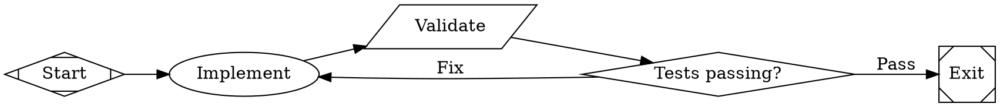

This tutorial uses a **sub-workflow node** to delegate part of a parent workflow to a separate, reusable child workflow. The parent plans a feature, hands off implementation to a child workflow that runs its own implement-test loop, then reviews the result.

## Prerequisites

Complete the [Branch & Loop](/tutorials/branch-loop) tutorial — the child workflow in this tutorial reuses that pattern.

## The child workflow

First, create a standalone implement-and-test workflow. This is a normal workflow that can run on its own or be invoked as a sub-workflow by a parent.

<Frame>
  
</Frame>



This is the same implement-test-fix loop from the [Branch & Loop](/tutorials/branch-loop) tutorial, packaged as its own file.

## The parent workflow

Now create a parent workflow that delegates to the child:

<Frame>
  
</Frame>

```dot title="sub-workflow.fabro"
digraph SubWorkflow {
    graph [goal="Create a Python module (tempconv.py) that converts between Celsius, Fahrenheit, and Kelvin, with pytest tests"]
    rankdir=LR

    start [shape=Mdiamond, label="Start"]
    exit  [shape=Msquare, label="Exit"]

    plan   [label="Plan", prompt="Analyze the goal. List the functions needed, their signatures, and edge cases. Write the plan to plan.md."]
    impl   [label="Implement & Test", shape=house, stack.child_workflow="implement-and-test.fabro", manager.max_cycles=50]
    review [label="Review", prompt="Read every file the child workflow created. Run the tests yourself with 'python3 -m pytest -v'. Verify the implementation matches plan.md and all tests pass. Write a short verdict to review.md."]

    start -> plan -> impl -> review -> exit
}
```

```bash
fabro run docs/internal/demo/12-sub-workflow.fabro
```

## The house node

The `impl` node has `shape=house`, which makes it a **sub-workflow node**. Instead of running an LLM or a script, it launches a separate engine to execute the child workflow file:

```dot
impl [label="Implement & Test", shape=house, stack.child_workflow="implement-and-test.fabro", manager.max_cycles=50]
```

The child workflow runs through its own start → implement → validate → gate → exit sequence. When it finishes, execution returns to the parent and continues to the `review` node.

### Sub-workflow attributes

| Attribute | Description |
|---|---|
| `stack.child_workflow` | Path to the child workflow file (resolved relative to the parent). |
| `stack.child_dot_source` | Inline child Graphviz source (alternative to `child_workflow`) |
| `manager.max_cycles` | Safety limit on poll cycles before the child is cancelled (default: 1000) |
| `manager.poll_interval` | How often to check for completion or stop conditions (default: `45s`) |
| `manager.stop_condition` | Condition expression that, when true, cancels the child early |

Use `stack.child_workflow` when you want to reuse the child workflow across multiple parents. Use `stack.child_dot_source` for one-off child workflows that are specific to the parent.

## What's shared and what's isolated

The child shares the parent's **run ID and event stream** — its stage events appear in the same run, so `fabro events` and `fabro inspect` see parent and child interleaved. The child gets its own **checkpoints, artifacts, and run directory**, so its working state can't pollute the parent.

Context flows bidirectionally:

1. **Parent → child:** The child receives a clone of the parent's context. In this example, the `plan` node writes `plan.md` to disk and the child's `implement` node reads it.
2. **Child → parent:** When the child finishes, any context values it added or changed are merged back into the parent. The `review` node sees the results of the child's work.

Only the _diff_ is merged — values the child didn't touch remain unchanged in the parent.

## Stop conditions

For long-running child workflows, you can set a stop condition that cancels the child early based on the parent's context:

```dot
impl [shape=house,
      stack.child_workflow="implement-and-test.fabro",
      manager.stop_condition="context.deploy_ready=true",
      manager.max_cycles=100]
```

The parent polls at `manager.poll_interval` (default 45 seconds). On each poll, it evaluates the stop condition against the current context. If the condition is true, the child is cancelled and the parent continues. This is useful when an external process (another branch, a webhook, a human gate) signals that the child's work is no longer needed.

## When to use sub-workflows

Sub-workflows are most valuable when:

- **Reusability** — the same child workflow is used by multiple parents (e.g., a standard test-and-fix loop, a deploy pipeline, a review checklist)
- **Encapsulation** — the child has its own checkpoints and artifacts, so its working state can't pollute the parent's
- **Supervisor patterns** — the parent needs to monitor or cancel a complex child process based on external conditions

For simpler cases, just add more nodes to a single workflow. Sub-workflows add a layer of indirection — use them when the benefits of reuse or encapsulation justify it.

## What you've learned

- **Sub-workflow nodes** (`shape=house`) run a child workflow inside a parent
- **`stack.child_workflow`** references an external workflow file for reuse
- **Context flows** from parent to child and back via diff merging
- **`manager.max_cycles`** prevents runaway child workflows
- **`manager.stop_condition`** cancels the child when an external signal arrives

## Further reading

<Columns cols={2}>
  <Card title="Nodes & Stages" icon="shapes" href="/workflows/stages-and-nodes">
    Complete reference for all node types.
  </Card>
  <Card title="Graphviz Language" icon="code" href="/reference/dot-language">
    Full syntax reference including sub-workflow attributes.
  </Card>
  <Card title="Context" icon="database" href="/execution/context">
    How context flows between nodes and across workflow boundaries.
  </Card>
  <Card title="Branch & Loop" icon="rotate" href="/tutorials/branch-loop">
    The implement-test-fix pattern used in the child workflow.
  </Card>
</Columns>
