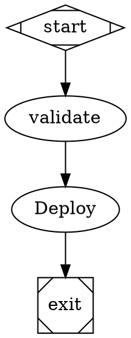
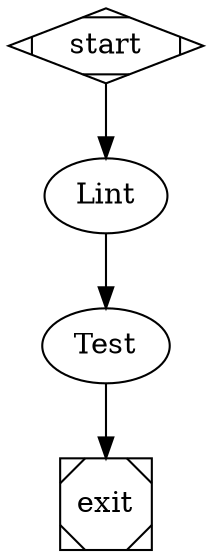
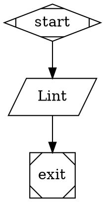
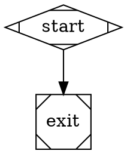

A workflow can pull in another `.fabro` file as a reusable subgraph. Use imports to factor a common pattern — a review loop, a validation pipeline, a deploy sequence — into its own file and splice it into many parent workflows.

Imports are resolved at parse time: the imported graph is merged into the parent's graph, with node IDs prefixed to avoid collisions. There is no runtime "sub-workflow" boundary; once merged, an imported node behaves like any other node in the run.

## Basic example

Place a node in the parent graph with an `import` attribute pointing at the file to splice in:



The imported file is a normal workflow graph with its own start and exit:



After expansion, the effective graph contains `start → validate.lint → validate.test → deploy → exit`. The `validate` placeholder is removed and its incoming/outgoing edges are rewired to the imported subgraph's entry and exit.

## Node ID prefixing

Imported nodes are renamed with the placeholder ID as a prefix, joined by a dot:

| Imported node | Becomes |
|---|---|
| `lint` | `validate.lint` |
| `test` | `validate.test` |

Edges inside the imported graph are rewritten to match. This means the same file can be imported multiple times in one workflow under different placeholder names without ID collisions.

The placeholder's `start` and `exit` sentinels are discarded — only the body is spliced in.

## Contract for imported files

An imported file must define a clean entry and exit so Fabro knows where to rewire edges:

- Exactly one start node (`shape=Mdiamond`, or ID `start`/`Start`) with exactly one outgoing edge.
- Exactly one exit node (`shape=Msquare`, or ID `exit`/`Exit`/`end`/`End`) with exactly one incoming edge.
- The boundary edges (start → entry, predecessor → exit) must carry no semantic attributes (no `condition`, `label`, `weight`, `fidelity`, `thread_id`, `loop_restart`, or `freeform`).

If the contract is violated, the placeholder is **poisoned**: its `import` attribute is replaced with `import_error`, and `fabro validate` reports the failure as a graph error.

## Placeholder attributes

A small set of attributes on the placeholder node propagate as **defaults** to every imported node. The imported node's own value wins when both are set.

| Attribute |
|---|
| `model` |
| `provider` |
| `reasoning_effort` |
| `speed` |
| `backend` |
| `acp_command` |
| `fidelity` |
| `max_retries` |
| `thread_id` |

```dot
validate [import="./validate.fabro", model="haiku", reasoning_effort="low"]
```

Every node from `validate.fabro` inherits `model="haiku"` and `reasoning_effort="low"` unless it sets its own value. Any attribute outside this list (other than `class`, see below) causes a poisoned placeholder.

## Class propagation

Classes on the placeholder are unioned into every imported node's class list, in addition to a class derived from the placeholder ID itself (lowercased, non-alphanumeric stripped). This lets [stylesheets](/workflows/stylesheets) target imported subgraphs as a group.

```dot
validate [import="./validate.fabro", class="fast, shared"]
```

Each imported node ends up with the classes it declared, plus `fast`, `shared`, and `validate`.

## Retry targets

`retry_target` and `fallback_retry_target` inside an imported file are rewritten to match the prefixed IDs:

```dot title="validate.fabro"
lint [prompt="...", retry_target="test"]
test [prompt="..."]
```

After import under the placeholder `validate`, `validate.lint`'s retry target becomes `validate.test` automatically.

## Templating

Imported files are parsed as static DOT before template expansion. The import path and graph structure must be literal, but templates remain supported inside final string attributes such as `prompt`, `script`, and `label`:



Do not put templates in `import` paths, node IDs, edge definitions, or other structural references. See [Variables](/workflows/variables#expansion-timing) for the rendering pipeline.

## Nested imports

An imported file can itself contain `import=` nodes. Relative paths resolve from the *importing* file's directory, so a shared library can reference its own siblings without knowing where it's loaded from:

```dot title="shared/review.fabro"
review_loop [import="./review-loop.fabro"]
```

Cycles are detected and reported as a poisoned placeholder rather than recursing.

## Empty imports as bypass

If the imported graph contains only `start` and `exit` (no body), the placeholder is removed and each incoming edge is cross-wired to each outgoing edge. This is useful for stubbing out an optional step:



Empty-import bypass is rejected if any of the placeholder's incoming or outgoing edges carry semantic attributes — those edges have nowhere to land.

## Error handling

When an import fails to resolve or violates the contract, Fabro does not abort parsing. Instead it leaves the placeholder node in place with an `import_error` attribute describing the failure. The `import_error` lint rule then surfaces this as a validation error from `fabro validate` and from run startup.

Common failure messages:

- `file not found: <path>` — the path does not resolve under the parent file's directory or the project fallback.
- `circular import detected: <chain>` — an import cycle was detected during expansion.
- `imported workflow must have exactly one start node, found <n>` — the contract above is violated.
- `import placeholder '<id>' has unsupported attribute '<key>'` — the placeholder uses an attribute that does not propagate.
- `empty import '<id>' cannot bypass semantic edges` — a body-less import sits between edges that carry conditions or labels.
