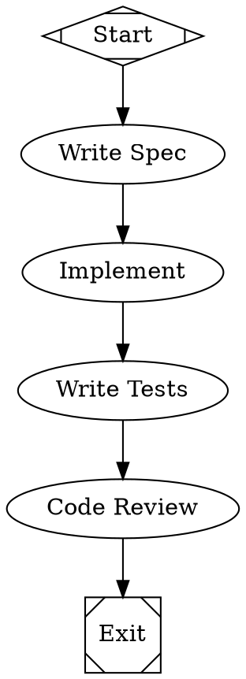

Model stylesheets let you assign LLM models, providers, and settings to workflow nodes using a CSS-like syntax. Instead of hardcoding a model on every node, you write a set of rules that target nodes by ID, class, shape, or a universal wildcard — and Fabro applies them by specificity.

## Defining a stylesheet

Stylesheets are set in the `model_stylesheet` graph attribute:



In this example:
- **spec** gets Haiku (matches `*`)
- **implement** and **test** get Sonnet with high reasoning (match `.coding`)
- **review** gets Gemini Pro (matches `#review`)

## Selectors

Each rule starts with a selector that determines which nodes it applies to:

| Selector | Syntax | Matches | Specificity |
|---|---|---|---|
| Universal | `*` | All nodes | 0 |
| Shape | `box`, `tab`, `hexagon`, etc. | Nodes with that Graphviz shape | 1 |
| Class | `.classname` | Nodes with `class="classname"` | 2 |
| ID | `#nodeid` | The node with that specific ID | 3 |

### Assigning classes

Set the `class` attribute on a node to target it with class selectors. Multiple classes are space-separated:

```dot
implement [label="Implement", class="coding critical"]
```

This node matches both `.coding` and `.critical` rules.

## Properties

Stylesheets support four properties:

| Property | Description | Example |
|---|---|---|
| `model` | Model ID or alias | `claude-sonnet-4-5`, `opus`, `gemini-pro` |
| `provider` | Provider name (optional — auto-inferred from the model catalog when omitted) | `anthropic`, `openai`, `gemini` |
| `reasoning_effort` | Reasoning effort level | `low`, `medium`, `high` |
| `speed` | Output speed mode. `fast` enables Anthropic's fast mode for up to 2.5x faster output at higher cost. | `fast` |
| `backend` | Agent execution backend — `api` (default) runs Fabro's own tool loop, `cli` delegates to a legacy external CLI tool, and `acp` runs an Agent Client Protocol stdio agent in the active sandbox. See [Backends](/core-concepts/agents#backends). | `api`, `cli`, `acp` |

See [Models](/core-concepts/models) for the full list of model IDs and aliases.

## Specificity and cascading

When multiple rules match the same node, the rule with the **highest specificity** wins. This follows the same principle as CSS:

```
* (0) < shape (1) < .class (2) < #id (3)
```

For example:

```
*       { model: claude-haiku-4-5; }
.coding { model: claude-sonnet-4-5; }
#review { model: gpt-5.2; }
```

A node with `id="review"` and `class="coding"` gets `gpt-5.2` because `#id` (specificity 3) beats `.class` (specificity 2).

If two rules have the same specificity, the **last one** in the stylesheet wins.

## Explicit attributes override stylesheets

A model set directly on a node attribute always takes precedence over stylesheets, regardless of specificity:

```dot
implement [label="Implement", class="coding", model="claude-opus-4-6"]
```

Even if `.coding` sets `model: claude-sonnet-4-5`, this node uses Opus because the explicit attribute wins.

## Syntax reference

The stylesheet syntax is a simplified subset of CSS:

```
selector { property: value; property: value; }
```

- Selectors: `*`, `shape`, `.class`, `#id`
- Properties and values are separated by `:`
- Declarations are separated by `;`
- Whitespace is flexible — newlines and indentation are ignored
- CSS comments (`/* ... */`) are not supported

### Full example

```
*            { model: claude-haiku-4-5;reasoning_effort: low; }
box          { reasoning_effort: high; }
tab          { reasoning_effort: low; }
.coding      { model: claude-sonnet-4-5;reasoning_effort: high; }
.review      { model: gemini-3.1-pro-preview;}
#final_check { model: claude-opus-4-6;reasoning_effort: high; }
```

This stylesheet:
- Defaults everything to Haiku with low reasoning
- Overrides all agent nodes (`box` shape) to high reasoning
- Keeps prompt nodes (`tab` shape) at low reasoning
- Routes `.coding` nodes to Sonnet
- Routes `.review` nodes to Gemini for independent critique
- Routes the `final_check` node to Opus for maximum quality
