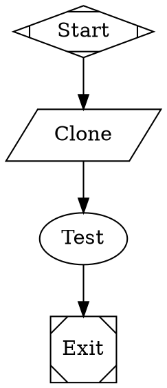

Fabro uses `{{ ... }}` templates for workflow strings and prompts.

## Template context

Workflow and prompt templates can reference:

| Expression | Resolves to |
|---|---|
| `{{ goal }}` | The workflow goal |
| `{{ inputs.name }}` | A value from `[run.inputs]`, optionally overridden by CLI input flags |

Environment variables are **not** available in workflow or prompt templates. Use `{{ env.NAME }}` only in config strings and HTTP hook headers.

## Run config inputs

Define typed inputs in `[run.inputs]`:

```toml title="run.toml"
_version = 1

[workflow]
graph = "check.fabro"

[run]
goal = "Run repository checks"

[run.inputs]
repo_name = "fabro"
repo_url = "https://github.com/fabro-sh/fabro"
language = "rust"
```

These values are available throughout the workflow as `{{ inputs.* }}`:



Override individual inputs at run time with repeatable `-I` / `--input` flags:

```bash
fabro run .fabro/workflows/check/workflow.toml -I repo_name=fabro-2 --input language=rust
```

CLI input values use TOML scalar parsing when possible. Quoted strings, booleans, integers, and floats keep their typed values; unquoted bare text falls back to a string. Empty values such as `foo=` are accepted as empty strings. Arrays, inline tables, and datetimes are rejected.

## `goal`

Agent and prompt nodes also receive the workflow goal at runtime:

```dot title="example.fabro"
digraph Example {
    graph [goal="Implement the login feature"]

    plan [label="Plan", prompt="Create a plan for: {{ goal }}"]
}
```



That prompt becomes `Create a plan for: Implement the login feature`.

## Expansion timing

Fabro expands templates in multiple passes:

1. Before DOT parsing, `{{ inputs.* }}` can parameterize structural parts of the graph, including imported `.fabro` files.
2. After parsing, all string graph, node, and edge attributes are rendered again with the real `{ goal, inputs }` context.
3. Agent and prompt handlers do a final runtime render pass as a safety net.

`{{ goal }}` is preserved through the pre-parse step so it can be resolved later. That means goal-dependent MiniJinja control flow such as `` is not useful in structural pre-parse templates.

## Undefined variables

Fabro uses strict undefined-variable handling. If a workflow template references an unknown value such as `{{ inputs.langauge }}`, validation fails instead of passing the literal text through to the model.

## Escaping

To emit literal template syntax, use MiniJinja escaping:

```dot
test [prompt="{{ goal }}"]
```

You can also emit literal braces with expressions such as `{{ '{{' }}` when needed.

## Input merging

TOML `[run.inputs]` tables intentionally replace the inherited map wholesale rather than merging by key. Whichever TOML layer has the highest precedence and sets `[run.inputs]` wins its entire map.

CLI input flags are different: they are sparse per-key overrides applied after config resolution, so unrelated inherited inputs remain available. If a key is repeated on the CLI, the last value wins.

| Source | Priority |
|---|---|
| CLI flags (`-I key=value` / `--input key=value`, repeated; per-key merge) | Highest |
| `workflow.toml` `[run.inputs]` | |
| `.fabro/project.toml` `[run.inputs]` | |
| `~/.fabro/settings.toml` `[run.inputs]` | Lowest |
