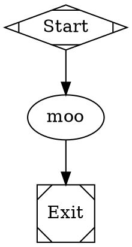

# Source-Aware Template Diagnostics Implementation Plan

> **For agentic workers:** REQUIRED SUB-SKILL: Use superpowers:subagent-driven-development (recommended) or superpowers:executing-plans to implement this plan task-by-task. Steps use checkbox (`- [ ]`) syntax for tracking.

**Goal:** Make `fabro run` and `fabro validate` template errors point to the real source file, line/column, and node context instead of MiniJinja's generic `<string>`.

**Architecture:** Preserve source provenance through template rendering instead of flattening errors to strings. `fabro-template` owns named MiniJinja rendering and typed span metadata; `fabro-workflow` owns workflow/node/attribute context; CLI and API layers render or serialize the structured diagnostics at their boundaries.

**Tech Stack:** Rust, MiniJinja, miette, thiserror, serde, OpenAPI/progenitor, cargo-nextest, insta snapshots.

---

## File Structure

- Modify `lib/crates/fabro-template/src/lib.rs` to add named render APIs and miette-aware `TemplateError` metadata.
- Modify `lib/crates/fabro-workflow/src/operations/create.rs`, `lib/crates/fabro-workflow/src/transforms/variable_expansion.rs`, `lib/crates/fabro-workflow/src/transforms/file_inlining.rs`, and `lib/crates/fabro-workflow/src/transforms/import.rs` to render templates with source and owner context.
- Modify `lib/crates/fabro-workflow/src/error.rs` to preserve source-aware template errors instead of converting them to `String`.
- Modify `lib/crates/fabro-validate/src/lib.rs`, `docs/public/api-reference/fabro-api.yaml`, and `lib/crates/fabro-server/src/run_manifest.rs` to expose optional source coordinates in validation diagnostics.
- Modify `lib/crates/fabro-cli/src/main.rs`, `lib/crates/fabro-cli/src/shared/utilities.rs`, and `lib/crates/fabro-cli/src/commands/run/output.rs` to render structured source metadata.
- Update or add tests in `lib/crates/fabro-template/src/lib.rs`, `lib/crates/fabro-workflow/src/operations/create.rs`, `lib/crates/fabro-cli/tests/it/cmd/validate.rs`, `lib/crates/fabro-cli/tests/it/cmd/run.rs`, and `lib/crates/fabro-server/src/server/tests.rs`.

## Task 1: Add Named Template Rendering

**Files:**
- Modify: `lib/crates/fabro-template/src/lib.rs`

- [x] **Step 1: Add failing unit tests for named template diagnostics**

Add tests that call the new API names below:

```rust
#[test]
fn render_named_reports_source_name_expression_and_span() {
    let ctx = TemplateContext::new();
    let err = render_named("prompts/test.md", "Hello {{ inputs.foo }}", &ctx).unwrap_err();

    let TemplateError::UndefinedVariable {
        expression,
        line,
        source_name,
        span,
        ..
    } = err
    else {
        panic!("expected undefined variable error");
    };

    assert_eq!(expression.as_deref(), Some("inputs.foo"));
    assert_eq!(line, Some(1));
    assert_eq!(source_name.as_deref(), Some("prompts/test.md"));
    assert!(span.is_some());
}

#[test]
fn render_lenient_named_preserves_source_name_for_syntax_errors() {
    let ctx = TemplateContext::new();
    let err = render_lenient_named("workflow.fabro", "{{ unterminated", &ctx).unwrap_err();

    let TemplateError::Syntax {
        source_name, ..
    } = err
    else {
        panic!("expected syntax error");
    };

    assert_eq!(source_name.as_deref(), Some("workflow.fabro"));
}
```

- [x] **Step 2: Run the tests and verify they fail**

Run:

```bash
cargo nextest run -p fabro-template render_named_reports_source_name_expression_and_span render_lenient_named_preserves_source_name_for_syntax_errors
```

Expected: tests fail because `render_named` and `render_lenient_named` do not exist.

- [x] **Step 3: Implement named rendering APIs**

Add these public functions and route existing `render` functions through an internal helper:

```rust
pub fn render(template: &str, ctx: &TemplateContext) -> Result<String, TemplateError> {
    render_with(None, template, ctx, UndefinedBehavior::Strict)
}

pub fn render_named(
    name: impl Into<String>,
    template: &str,
    ctx: &TemplateContext,
) -> Result<String, TemplateError> {
    render_with(Some(name.into()), template, ctx, UndefinedBehavior::Strict)
}

pub fn render_lenient(template: &str, ctx: &TemplateContext) -> Result<String, TemplateError> {
    render_with(None, template, ctx, UndefinedBehavior::Chainable)
}

pub fn render_lenient_named(
    name: impl Into<String>,
    template: &str,
    ctx: &TemplateContext,
) -> Result<String, TemplateError> {
    render_with(Some(name.into()), template, ctx, UndefinedBehavior::Chainable)
}
```

In `render_with`, use `env.render_named_str(&name, template, ctx.clone().into_value())` when a name is present, and `env.render_str(...)` otherwise. Keep the current plain-text fast path.

- [x] **Step 4: Store source metadata on `TemplateError`**

Extend each `TemplateError` variant with:

```rust
source_name: Option<String>,
source_text: Option<String>,
span: Option<miette::SourceSpan>,
```

In `From<minijinja::Error> for TemplateError`, populate:

```rust
let source_name = error.name().map(str::to_owned);
let source_text = error.template_source().map(str::to_owned);
let span = error
    .range()
    .and_then(|range| {
        let start = range.start;
        let len = range.end.checked_sub(range.start)?;
        Some((start, len).into())
    });
```

Preserve the existing `expression` and `line` behavior.

- [x] **Step 5: Derive or implement `miette::Diagnostic` for `TemplateError`**

Use `#[derive(miette::Diagnostic)]` if it stays readable. If derive becomes awkward because of enum variants, implement `miette::Diagnostic` manually so `source_code()` returns a `NamedSource<String>` when both `source_name` and `source_text` exist, and `labels()` returns a label for `span`.

- [x] **Step 6: Verify template tests**

Run:

```bash
cargo nextest run -p fabro-template
```

Expected: all `fabro-template` tests pass.

## Task 2: Preserve Template Errors in Workflow Errors

**Files:**
- Modify: `lib/crates/fabro-workflow/src/error.rs`
- Modify: `lib/crates/fabro-workflow/Cargo.toml`

- [x] **Step 1: Add a failing error-chain regression test**

Add a test showing that a workflow template error remains visible as a source cause:

```rust
#[test]
fn template_error_variant_preserves_source_chain() {
    let template_err = fabro_template::render_named(
        "workflow.fabro",
        "{{ inputs.missing }}",
        &fabro_template::TemplateContext::new(),
    )
    .unwrap_err();

    let err = Error::template("template expansion failed", template_err);
    let chain = collect_chain(&err);

    assert!(chain.iter().any(|part| part.contains("template expansion failed")));
    assert!(chain.iter().any(|part| part.contains("undefined template variable")));
}
```

- [x] **Step 2: Run the test and verify it fails**

Run:

```bash
cargo nextest run -p fabro-workflow template_error_variant_preserves_source_chain
```

Expected: test fails because `Error::template` does not exist.

- [x] **Step 3: Add a structured workflow error variant**

Add a new `Error` variant:

```rust
#[error("{message}")]
Template {
    message: String,
    #[source]
    source: fabro_template::TemplateError,
}
```

Add:

```rust
pub fn template(message: impl Into<String>, source: fabro_template::TemplateError) -> Self {
    Self::Template {
        message: message.into(),
        source,
    }
}
```

Update failure classification to treat `Template` as deterministic validation/parse failure.

- [x] **Step 4: Delegate miette metadata from workflow template errors**

Implement `miette::Diagnostic` for `Error` or add a wrapper diagnostic used by the CLI so `Error::Template { source, .. }` delegates `source_code`, `labels`, `code`, and `help` to the underlying `TemplateError`.

- [x] **Step 5: Replace string conversion helper**

Remove the current `template_parse_error(&TemplateError) -> Error` stringification path in `operations/create.rs` and convert call sites to:

```rust
.map_err(|err| Error::template("template expansion failed", err))?
```

- [x] **Step 6: Verify workflow error tests**

Run:

```bash
cargo nextest run -p fabro-workflow template_error_variant_preserves_source_chain
```

Expected: test passes.

## Task 3: Render DOT Attributes Source-Aware After Parse

**Files:**
- Modify: `lib/crates/fabro-workflow/src/operations/create.rs`
- Modify: `lib/crates/fabro-workflow/src/transforms/variable_expansion.rs`
- Modify: `lib/crates/fabro-workflow/src/pipeline/transform.rs`

- [x] **Step 1: Add a failing workflow test for inline prompt source context**

Add a test in `operations/create.rs`:

```rust
#[test]
fn strict_template_error_for_inline_prompt_names_workflow_file_and_node() {
    let dot = r#"digraph ValidatePlan {
        start [shape=Mdiamond, label="Start"]
        exit  [shape=Msquare, label="Exit"]
        test_inline_prompt [label="moo" prompt="{{ inputs.foo }}"]
        start -> test_inline_prompt -> exit
    }"#;

    let err = preprocess_and_validate(
        dot,
        Some(PathBuf::from(".")),
        None,
        Vec::new(),
        None,
        None,
        RenderMode::Strict,
        &test_catalog(),
    )
    .unwrap_err();

    let rendered = collect_chain(&err).join(": ");
    assert!(rendered.contains("test_inline_prompt"));
    assert!(rendered.contains("prompt"));
    assert!(!rendered.contains("<string>"));
}
```

- [x] **Step 2: Run the test and verify it fails**

Run:

```bash
cargo nextest run -p fabro-workflow strict_template_error_for_inline_prompt_names_workflow_file_and_node
```

Expected: test fails because the pre-parse render path still reports a generic template source.

- [x] **Step 3: Remove strict pre-parse DOT rendering**

In `preprocess_and_validate`, delete the initial strict whole-file `render_template(dot_source, ...)` phase. Always parse `dot_source` first, then apply transforms. For `RenderMode::Structural`, keep undefined input warnings by letting the template transform collect diagnostics instead of rendering the whole DOT file.

- [x] **Step 4: Add source options to the template transform**

Change `TemplateTransform` to carry:

```rust
pub struct TemplateTransform {
    pub inputs: HashMap<String, toml::Value>,
    pub source_name: Option<String>,
    pub render_mode: RenderMode,
}
```

Render graph attrs, node attrs, and edge attrs one value at a time. Use names like:

```rust
workflow.fabro graph attribute `goal`
workflow.fabro node `test_inline_prompt` attribute `prompt`
workflow.fabro edge `start -> test_inline_prompt` attribute `label`
```

When source path is unknown, use `workflow`.

- [x] **Step 5: Attach owner context to errors and diagnostics**

For strict mode, wrap template errors with context:

```text
template expansion failed in node `test_inline_prompt` attribute `prompt`
```

For structural mode undefined variables, produce a warning diagnostic with `node_id` set to the owning node id and `message` including the source path and line when available.

- [x] **Step 6: Verify workflow transform tests**

Run:

```bash
cargo nextest run -p fabro-workflow strict_template_error_for_inline_prompt_names_workflow_file_and_node
cargo nextest run -p fabro-workflow template_transform
```

Expected: source-aware test and existing template transform tests pass.

## Task 4: Make Prompt File Rendering First-Class

**Files:**
- Modify: `lib/crates/fabro-workflow/src/transforms/file_inlining.rs`
- Modify: `lib/crates/fabro-workflow/src/transforms/variable_expansion.rs`

- [x] **Step 1: Add a failing test for imported prompt source attribution**

Add a test that builds a graph with `prompt="@test.md"` and a resolver returning `{{ inputs.foo }}` for `test.md`. Assert strict mode errors mention `test.md`, `test_imported_prompt`, and `prompt`.

- [x] **Step 2: Run the test and verify it fails**

Run:

```bash
cargo nextest run -p fabro-workflow imported_prompt_template_error_names_prompt_file_and_node
```

Expected: test fails because file inlining currently loses the prompt file source.

- [x] **Step 3: Render prompt attribute paths before resolving file references**

For node `prompt` and graph `goal`, first render the attribute value with the workflow source name so templated paths like `@{{ inputs.prompt_file }}` continue to work.

- [x] **Step 4: Resolve `@file` references and render file contents with resolved path**

When a prompt or goal value resolves to a file, render the file contents using:

```rust
render_named(resolved.path.display().to_string(), &resolved.content, &ctx)
```

Wrap failures with node/attr context from the referencing graph value.

- [x] **Step 5: Keep non-file string attributes on workflow source**

Only prompt and goal `@file` references switch to the resolved file source. Other string attributes render against their owning workflow/import file source.

- [x] **Step 6: Verify prompt source tests**

Run:

```bash
cargo nextest run -p fabro-workflow imported_prompt_template_error_names_prompt_file_and_node
```

Expected: test passes.

## Task 5: Make Import Rendering Source-Aware

**Files:**
- Modify: `lib/crates/fabro-workflow/src/transforms/import.rs`

- [x] **Step 1: Add failing tests for import source attribution**

Add tests for:

```rust
#[test]
fn templated_import_path_error_names_importing_node() { /* import="{{ inputs.path }}" */ }

#[test]
fn imported_workflow_template_error_names_imported_file() { /* imported file contains "{{ inputs.foo }}" */ }
```

- [x] **Step 2: Run the tests and verify they fail**

Run:

```bash
cargo nextest run -p fabro-workflow templated_import_path_error_names_importing_node imported_workflow_template_error_names_imported_file
```

Expected: tests fail with stringified or generic template errors.

- [x] **Step 3: Render import attributes with node context**

Before resolving an import path, render the placeholder node's `import` attr with a named template source and wrap failures with the placeholder node id.

- [x] **Step 4: Parse imported workflows from their own source name**

When rendering imported workflow content for parse preparation, call `render_named(resolved_file.path.display().to_string(), ...)`. Preserve errors as `Error::Template`.

- [x] **Step 5: Verify import tests**

Run:

```bash
cargo nextest run -p fabro-workflow templated_import_path_error_names_importing_node imported_workflow_template_error_names_imported_file
```

Expected: tests pass.

## Task 6: Serialize Source Coordinates in Validation Diagnostics

**Files:**
- Modify: `lib/crates/fabro-validate/src/lib.rs`
- Modify: `docs/public/api-reference/fabro-api.yaml`
- Modify: `lib/crates/fabro-server/src/run_manifest.rs`
- Modify: `lib/crates/fabro-cli/src/commands/run/output.rs`

- [x] **Step 1: Add optional fields to `fabro_validate::Diagnostic`**

Add:

```rust
pub source_path: Option<String>,
pub line: Option<u32>,
pub column: Option<u32>,
pub span_start: Option<usize>,
pub span_len: Option<usize>,
pub related: Vec<RelatedDiagnostic>,
```

Add:

```rust
#[derive(Debug, Clone, Serialize, Deserialize)]
pub struct RelatedDiagnostic {
    pub message: String,
    pub source_path: Option<String>,
    pub line: Option<u32>,
    pub column: Option<u32>,
}
```

Update all existing diagnostic constructors with `..Diagnostic::default()` by deriving or implementing `Default` for `Diagnostic`.

- [x] **Step 2: Update OpenAPI schema**

Add the same optional fields to `WorkflowDiagnostic` in `docs/public/api-reference/fabro-api.yaml`, and add a `RelatedWorkflowDiagnostic` schema.

- [x] **Step 3: Regenerate Rust API types**

Run:

```bash
cargo build -p fabro-api
```

Expected: build succeeds and generated types include the new optional fields.

- [x] **Step 4: Map diagnostics to and from API DTOs**

Update `diagnostics_to_api` and CLI `api_diagnostic_to_local` to preserve all new optional fields and related diagnostics.

- [x] **Step 5: Verify API build**

Run:

```bash
cargo build -p fabro-api
```

Expected: build succeeds.

## Task 7: Render CLI Output with Source Context

**Files:**
- Modify: `lib/crates/fabro-cli/src/main.rs`
- Modify: `lib/crates/fabro-cli/src/shared/utilities.rs`
- Modify: `lib/crates/fabro-cli/tests/it/cmd/validate.rs`
- Modify: `lib/crates/fabro-cli/tests/it/cmd/run.rs`

- [x] **Step 1: Add CLI snapshot coverage for issue #287**

Add fixtures or temp workflows for:



and:


with `test.md` containing:

```markdown
{{ inputs.foo }}
```

- [x] **Step 2: Run snapshots and verify they fail**

Run:

```bash
cargo nextest run -p fabro-cli validate_template_source_attribution run_rejects_unbound_template_inputs_before_creating_remote_run
```

Expected: snapshots fail because output still contains `<string>` or lacks source context.

- [x] **Step 3: Delegate fatal miette diagnostics through CLI wrapper**

Update `CliDiagnostic` so `impl miette::Diagnostic for CliDiagnostic` delegates `source_code`, `labels`, `code`, and `help` to the wrapped error when the wrapped error chain contains a `miette::Diagnostic`.

- [x] **Step 4: Print validation diagnostics with source coordinates**

Update `print_diagnostics` so diagnostics with `source_path`, `line`, and `column` print a compact prefix:

```text
warning: test.md:1:1: undefined template variable `inputs.foo` (template_undefined_variable)
```

Keep the existing message shape for diagnostics without source coordinates.

- [x] **Step 5: Verify CLI snapshots**

Run:

```bash
cargo nextest run -p fabro-cli validate_template_source_attribution run_rejects_unbound_template_inputs_before_creating_remote_run
cargo insta pending-snapshots
```

Expected: only the intended snapshots are pending. Inspect them, then accept only the intended updates:

```bash
cargo insta accept
```

## Task 8: Add API Validation Coverage

**Files:**
- Modify: `lib/crates/fabro-server/src/server/tests.rs`

- [x] **Step 1: Add a validation endpoint test for source fields**

Add a test that posts a run manifest containing an imported prompt with an undefined template variable and asserts the first diagnostic includes:

```rust
assert_eq!(diagnostic["source_path"], "test.md");
assert_eq!(diagnostic["line"], 1);
assert!(diagnostic["node_id"].as_str().unwrap().contains("test_imported_prompt"));
```

- [x] **Step 2: Run the server test**

Run:

```bash
cargo nextest run -p fabro-server validate_endpoint_returns_template_source_coordinates
```

Expected: test passes.

## Task 9: Final Verification

**Files:**
- No additional edits.

- [x] **Step 1: Run focused test suite**

Run:

```bash
cargo nextest run -p fabro-template
cargo nextest run -p fabro-workflow
cargo nextest run -p fabro-cli validate_template_source_attribution run_rejects_unbound_template_inputs_before_creating_remote_run
cargo nextest run -p fabro-server validate_endpoint_returns_template_source_coordinates
```

Expected: all tests pass.

- [x] **Step 2: Run API build**

Run:

```bash
cargo build -p fabro-api
```

Expected: build succeeds.

- [x] **Step 3: Run formatting check**

Run:

```bash
cargo +nightly-2026-04-14 fmt --check --all
```

Expected: formatting check passes.

- [x] **Step 4: Run clippy if the touched crates compile cleanly**

Run:

```bash
cargo +nightly-2026-04-14 clippy --workspace --all-targets -- -D warnings
```

Expected: clippy passes.

## Assumptions

- This is a greenfield app, so internal workflow/template APIs and OpenAPI diagnostic DTOs may change.
- Template support after this change is scoped to parsed string attributes and referenced workflow/prompt files, not arbitrary structural DOT templating.
- API responses expose coordinates and context, not full source text.
- Rich source snippets are rendered in local CLI output through `miette`; server/API clients receive structured metadata.
- Existing diagnostics without source metadata keep their current behavior.
